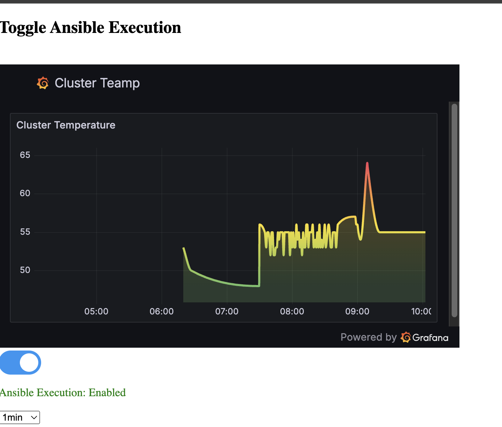

# System-Temperature-Dashboard
 Web Server has a switch with a drop down list of timing. When clicked it will action the following via JS>Flash>Ansible>Python>InfluxDB>Grafana to display a live graph of temp of a device as it changes over time. It could be done a lot simpler but this is more to work out some complexities inter language and solutions.
